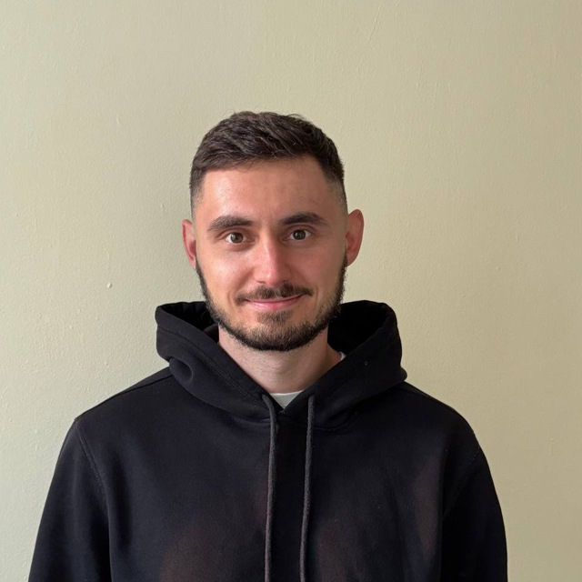

# **Uladzislau Sialiuk**
*****
## **Contacts**
* **Location:** Homel, Belarus
* **Email:** [selukvlad12@gmail.com](mailto:selukvlad12@gmail.com)
* **Phone:** [+375(29)198-44-60](tel:+375(29)198-44-60)
* **Telegram:** [vladfutbik](https://t.me/vladfutbik)
* **Instagram:** [https://www.instagram.com/vladseluk](https://www.instagram.com/vladseluk)
* **WhatsApp:** +375(29)198-44-60
* **Profile on freelance.ru:** [https://freelance.ru/vladsel](https://freelance.ru/vladsel)
* **GitHub:** [https://github.com/Vlad93](https://github.com/Vlad93)

## Profile
I am 31 years old. I am a former professional futsal player (Belarus National Team).
I took various courses, improved my skills, worked as a web developer(Wordpress primally) and freelancer. Now I continue to constantly learn something new.
At the moment, my main goal is to fill the gaps in knowledge about the JavaScript language and master the React library.

## Skills and Technologies
* ***HTML5***
* ***CSS***
* ***SASS***(*SCSS*)
* ***BEM***
* ***JavaScript***
* ***GULP***
* ***Vite***, ***Webpack***
* ***Jest***
* ***Git***
* ***ESLint***
* ***PHP***
* ***WordPress***

## Code Examples
My solution of [Persistent Bugger](https://www.codewars.com/kata/55bf01e5a717a0d57e0000ec) Kata on CodeWars.
****
```js
function persistence(num) {   
  let count = 0;
  while(num.toString().length > 1) {
    count++;
    num = num.toString().split('')
      .reduce((acc, item) => acc * Number(item), 1);
  }  
  return count;
}
```
****
Link to my profile on CodeWars: [Vlad93](https://www.codewars.com/users/Vlad93) 

## Experience 
1. [**Автошкола Ягуар**](https://jaguar-avtoshkola.ru/) - Digital autoschool
2. [**Radema**](https://radema.ru/) - Marketing agency site
3. [**Dveri-prof**](https://dveri-prof.by/) - Doors catalog
4. [**Народный выбор**](https://narodny-vybor.by/) - Voiting and blog site
5. [**Колесо фортуны и квиз**](https://client.svetlyj.by/) - Quiz and wheel of fortune (layout and js)
6. [**Senseclinic**](https://senseclinic.ru/) - Stomatology clinic


## Education
* **Belarusian State University of Transport (BelSUT)**
* **WayUp**
* **Skillbox**
* **RSSchool** (not complete 'JavaScript/Front-end')

## Languages
* Russian - native
* Belarusian - native
* English - A2 (B1 in progress)